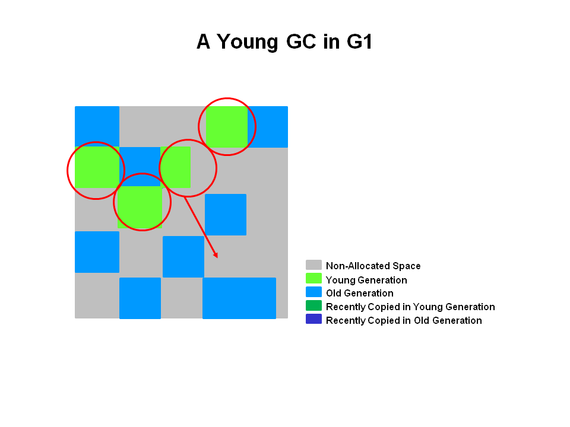

# Overview

- 像CMS收集器一样，能与应用程序线程并发执行。
- 整理空闲空间更快。
- 需要GC停顿时间更好预测。
- 不希望牺牲大量的吞吐性能。
- 不需要更大的Java Heap。

G1 的出现就是为了干掉CMS。它同CMS相比，在以下方面表现的更出色：

- G1是一个有整理内存过程的垃圾收集器，不会产生很多内存碎片。
- G1的Stop The World(STW)更可控，G1在停顿时间上添加了预测机制，用户可以指定期望停顿时间。

# G1 Heap Allocation

serial, parallel, CMS把垃圾回收器分成上面几个部分：Young Generation、Old Generation、Permanent Generation。在内存管理上，G1依然采用**分代** 的内存管理方式，但是跟以往的垃圾回收算法不同的是，G1将整个堆划分成很多大小相同的小块，这些小块称为Region。Eden区、Survivor区、老年区都由若干Region组成，并且这些Region的数量在程序运行中是可变的。

* Eden区
* Survivor区
* Old Generation
  * Humongous区。当需要分配一个超过Region一半大小的大对象时。

region具有如下的一些特点:

* 整个堆被分作大约2000个rigion.
* region在分代之间不连续
* Minimum = 1Mb,  maximum = 32Mb

# Young GC in G1

* 是否Stop the World： 是
* 触发条件：Eden区被填满
* 过程：Eden区存活对象拷贝至Survivor，Survivor区存活对象如果年龄小于阈值则拷贝至其他Survivor Region，否则会被提升至老年代Region中。

年轻代大小会根据设定的最大暂停时间进行自适应调整。一个基本假定是：空间越大，回收越慢，空间越小，回收越快，G1会据此调整堆的大小以满足暂停时间的要求。

# Old GC in G1

* 是否Stop the World：部分阶段Stop the World
* 触发条件：
  * 整个堆空间的使用率达到特定的值（通过InitiatingHeapOccupancyPercent控制，默认45%）
  * 大对象分配
* 过程

| Phase                                    | Description                              |
| ---------------------------------------- | ---------------------------------------- |
| (1) Initial Mark*(Stop the World Event)* | This is a stop the world event. With G1, it is piggybacked on a normal young GC. Mark survivor regions (root regions) which may have references to objects in old generation. |
| (2) Root Region Scanning                 | Scan survivor regions for references into the old generation. This happens while the application continues to run. The phase must be completed before a young GC can occur. |
| (3) Concurrent Marking                   | Find live objects over the entire heap. This happens while the application is running. This phase can be interrupted by young generation garbage collections. |
| (4) Remark*(Stop the World Event)*       | Completes the marking of live object in the heap. Uses an algorithm called snapshot-at-the-beginning (SATB) which is much faster than what was used in the CMS collector. |
| (5) Cleanup*(Stop the World Event and Concurrent)* | Performs accounting on live objects and completely free regions. (Stop the world)Scrubs the Remembered Sets. (Stop the world)Reset the empty regions and return them to the free list. (Concurrent) |
| (*) Copying*(Stop the World Event)*      | These are the stop the world pauses to evacuate or copy live objects to new unused regions. This can be done with young generation regions which are logged as `[GC pause (young)]`. Or both young and old generation regions which are logged as `[GC Pause (mixed)]`. |

# Full GC

G1的Full GC与CMS一样，都是用Serial Old垃圾收集器。特别是G1一般用在大内存的场景下，其后果更加严重。

G1场景下发生Full GC的通常原因：

（1）元空间耗尽(MetaspaceSize, 对应原来的永久代，java8废除了永久代)

（2）to space exhausted

（3）对象产生及提升太快，在并发标记阶段完成之前就填满了堆空间

# 参考资料

* [Getting Started with the G1 Garbage Collector](http://www.oracle.com/webfolder/technetwork/tutorials/obe/java/G1GettingStarted/index.html)
* [Garbage First Garbage Collector Tuning](http://www.oracle.com/technetwork/articles/java/g1gc-1984535.html)