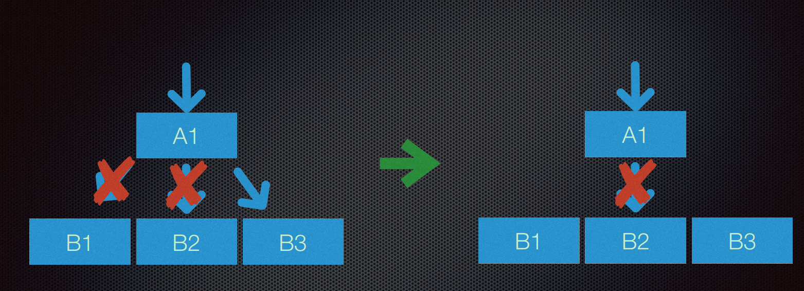

# 工具

## 1.查看消耗资源最多的线程

```shell
top -H -p $pid
$pid: 要分析程序的进程ID
```

我们将用top命令得出pid，[换算](http://tool.oschina.net/hexconvert)成十六进制， 例如：0x34ac8。

拿到了ID如何去对应堆栈信息里面的ID呢？

## 2. 使用jstack命令打出堆栈信息

```shell
jstack $pid
$pid: 要分析程序的进程ID
```

执行上述命令后，会打印出pid的堆栈信息，为了方便起见，可以重定向到文件中，然后使用grep命令查找字符串0x34ac8。

## 3.CPU耗时分析

```shell
bash busy_threads.sh -p $pid -c $cnt
$pid: 要分析程序的进程ID
$cnt: top排名个数
```

[busy_threads.sh](线上问题总结/busy_threads.sh)

# case

## 1. rpc调用超时

现象：上游服务99-percent 很高，大概是1kms的延时，但是下游的业务监控延时很低，大概是50ms。

原因：下游服务提供了A, B , C 三个接口，其中C接口是同步进行的，C接口耗尽了线程池里的线程。业务监控到的是实际执行的时间50ms，但是上游感受到的时间是：线程池队列等待的时间+实际的执行时间=1kms。定位到的方法是jstack发现很多被Block住的线程，最终临时解决的方法是先让下游改成异步调用，再继续定位问题。

## 2. 部分请求调用出错

现象：app -> query -> delivery 。app -> query，调用出错次数增加。query-> delivery发现是Read TimeOut，delivery自身监控没问题，基于第1条的经验教训，查看了线程池有没有阻塞的情况，发现并没有线程阻塞，最终查看ReadTimeOut的exception Stack是在thrift结构中第2000行左右读超时，查看delivery改动，发现最终是多线程写入一个Map<String,String> ，不是一个线程安全的。

## 3.服务雪崩效应


通过线程池进行隔离、服务级别的熔断，有效的避免服务间的雪崩。



如果一个集群中出现单点故障，广告业务中适合快速失败，不然一直拖垮整个集群，发生雪崩效应。

* 服务的业务隔离，重要业务放在单独的服务上（DE和DE-APPSTORE）
* 今早失败，避免等待
* 连接池共享-> 独享
* 负载均衡和熔断
* 降级服务
* 灰度发布和主动监控

# 4. GC优化

用eclipse-collection 优化存储，反之频繁GC

